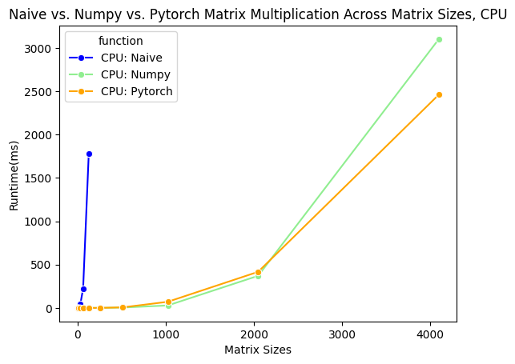
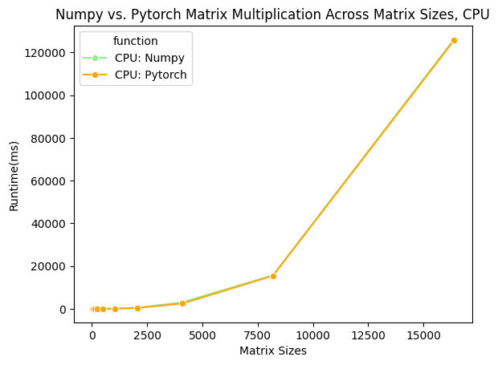
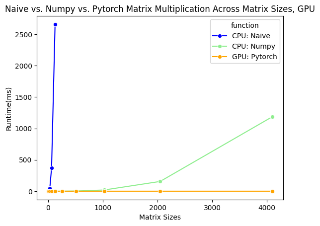
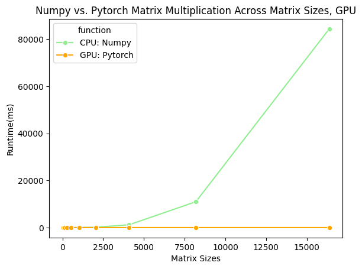

# DSC-210-Group17-Final-Project

This repository contains Group 17’s final project code for Fall 2024. The goal of our research is to analyze the runtime performance of matrix multiplication using three methods: the Naive algorithm, the Numpy library, and the PyTorch library. We evaluate their performance on matrices of increasing sizes with hardware accelerators set to either a CPU or a T4 GPU on Google Colab.

## Project Overview

To test the performance of different matrix multiplication methods across various hardware accelerators, we created two notebooks:

### 1. CPU Performance Comparison
- Notebook: `DSC210-FA24-Group17-Final-Project-Experiment-Notebook-CPU.ipynb`
- **Steps to Run:**
  1. Open the notebook on Google Colab. You can just click on this [link](https://colab.research.google.com/drive/199YYmbVCnH4eAG1626o70nLSW_yT2aFq?usp=sharing), which will direct you to the notebook on Colab. 
  2. Click on `Runtime` > `Change runtime type` in the toolbar and select `CPU` as the hardware accelerator. If you're unsure how to configure the hardware accelerator in Google Colab, refer to this helpful [tutorial](https://saturncloud.io/blog/how-to-activate-gpu-computing-in-google-colab/).
  3. Run all cells from start to finish (runtime: ~5–10 minutes).

- **Results:**
  - **Figure I:** Compares the runtime of the Naive algorithm, Numpy, and PyTorch on a CPU. 
    - The **Naive algorithm** (blue line) is significantly slower and is only tested up to a matrix size of 128 due to its excessive runtime.
    - **Numpy** (green line) and **PyTorch** (orange line) exhibit similar performance for matrix sizes up to $2^{12}$ (4096).
  
  - **Figure II:** Extends the comparison between Numpy and PyTorch for matrix sizes up to $2^{14}$ (16384). Both perform similarly under a CPU due to the sequential nature of operations.
  
---

### 2. GPU Performance Comparison
- Notebook: `DSC210-FA24-Group17-Final-Project-Experiment-Notebook-GPU.ipynb`
- **Steps to Run:**
  1. Open the notebook on Google Colab. You can just click on this [link](https://colab.research.google.com/drive/1M9M9w1nm-3P7RGL2Yhf5kecqiDQgBeEe?usp=sharing), which will direct you to the notebook on Colab. 
  2. Click on `Runtime` > `Change runtime type` in the toolbar and select `T4 GPU` as the hardware accelerator.If you're unsure how to configure the hardware accelerator in Google Colab, refer to this helpful [tutorial](https://saturncloud.io/blog/how-to-activate-gpu-computing-in-google-colab/).
  3. Run all cells from start to finish (runtime: ~10–15 minutes).

- **Results:**
  - **Figure I:** Compares the runtime of the Naive algorithm, Numpy, and PyTorch with GPU support.
    - The **Naive algorithm** (blue line) is again tested only up to a matrix size of 128 due to its slow runtime.
    - **PyTorch** (orange line) significantly outperforms **Numpy** (green line) for matrix sizes up to $2^{12}$ (4096). The nearly horizontal PyTorch line demonstrates the benefits of GPU-accelerated parallel computation.
  
  - **Figure II:** Extends the comparison between Numpy and PyTorch for matrix sizes up to $2^{14}$ (16384). **PyTorch** consistently outperforms **Numpy**, especially for larger matrix sizes.
  
---

### Additional Notes:
- Both notebooks include runtime measurements (in milliseconds) and visualize results through detailed graphs.
